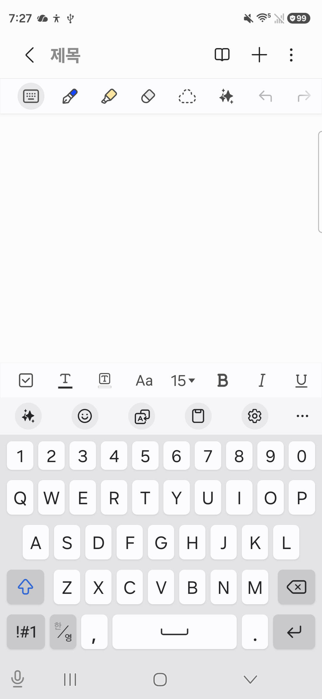
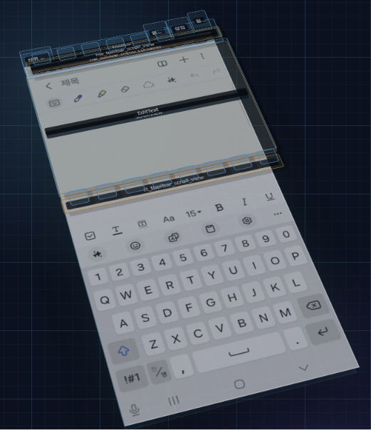
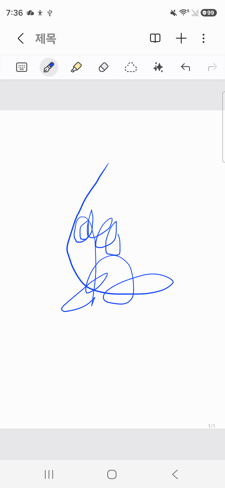
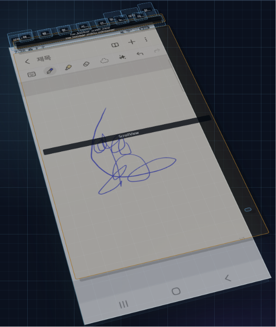
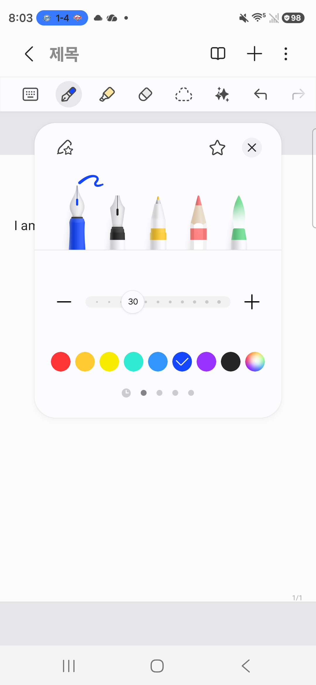
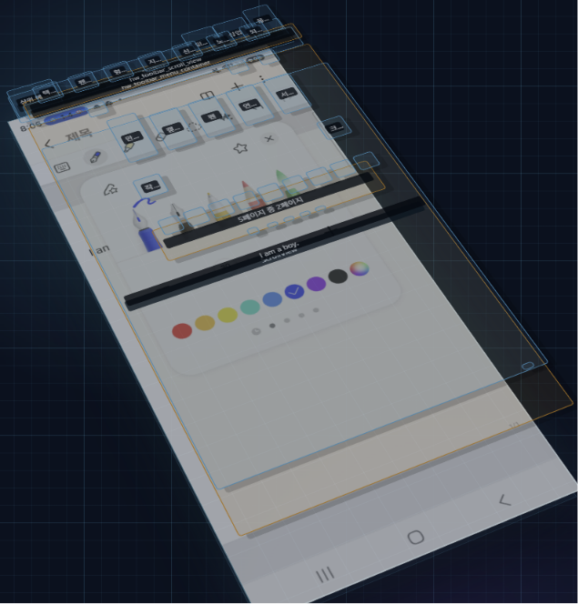
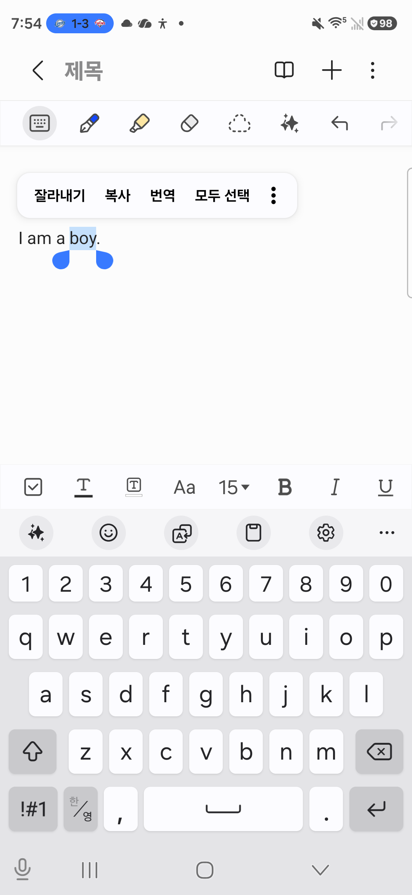
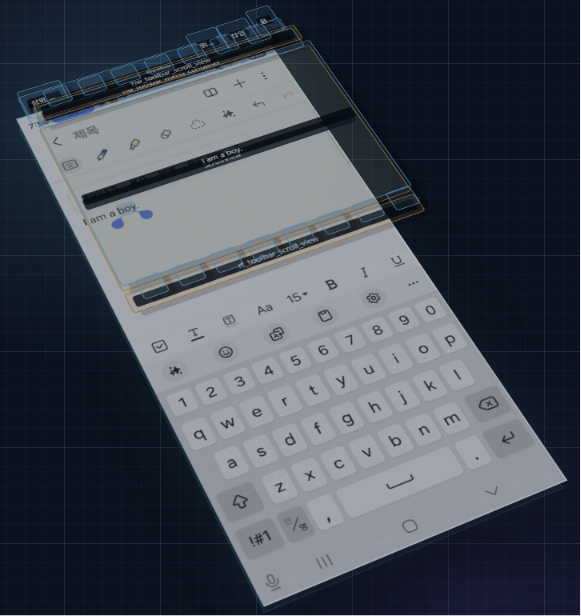
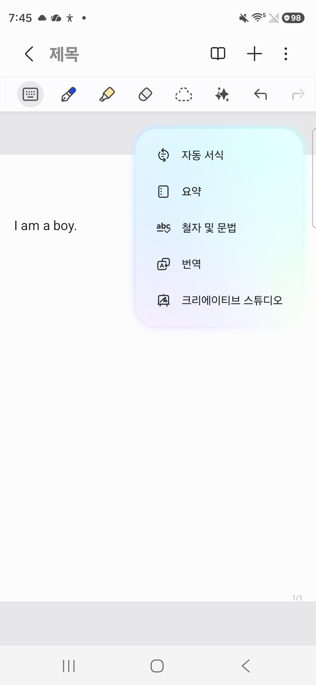
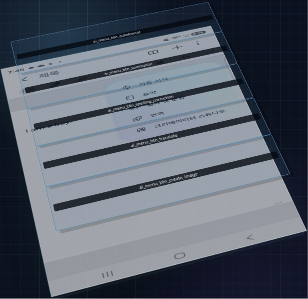

# Samsung Notes — 자동탐색 난제 케이스 정리

> **목적**: 본 프로젝트(android-ui-exhaustive-explorer)가 Samsung Notes 앱을 자동으로 완전탐색할 때,
> Accessibility(a11y) / UI Automator 기반 dump 만으로는 잡기 어려운 UI 케이스를 정리한다.
>
> **검증 도구**: `android-ui-dump-visualizer` (별도 도구) 의 Quarter(3D) view 로
> **(1) 화면에 실제로 보이는 것** ↔ **(2) dump 가 잡은 것** 을 시각적으로 비교한다.
>
> **검증 환경**: SM-S947U1 / Android 16 / Samsung Notes (One UI 기본 탑재)

---

## 검증 방법 (재현 절차)

### 환경 준비

```powershell
# 1. 단말 USB 연결 + adb debugging 허용
# 2. Samsung Notes 앱을 검사 대상 화면까지 수동 진입
# 3. android-ui-dump-visualizer 서버 기동 (별도 도구)
node server.js
# → http://localhost:3000
```

### 각 케이스 캡처

1. 단말에서 **케이스에 해당하는 화면** 정확히 띄움
2. 브라우저에서 `http://localhost:3000` 열고 **Refresh** 클릭
   → 서버가 `adb shell uiautomator dump` + `adb exec-out screencap -p` 수행
3. **Flat / Quarter 모드 전환** 으로 layer 깊이 관찰
4. 원본 스크린샷은 `runtime/screenshot.png` 에 저장됨
5. 3D view 는 브라우저에서 캡처 (스크린샷 키)

### 비교 시점

- **있어야 할 것이 dump 에 없음** → a11y/UIAutomator 사각지대 → 본 문서에 케이스로 등재
- **있어야 할 것이 dump 에 있음** → 정상 탐색 가능 → 케이스 등재 불필요

---

## 케이스 색인

실측 검증한 5 케이스만 정리한다 (SM-S947U1 / Android 16 / Samsung Notes).
가설 단계의 다른 케이스는 보고 신뢰도 유지를 위해 본 문서에서 제외 — 추후 캡처 시 추가 예정.

| # | 케이스 | 한계 분류 | 보완 Tier |
|---|---|---|---|
| 1 | SIP 키보드 (Samsung Keyboard) | §2 다중 윈도우 — IME window 누락 | `getWindows()` 반복 + `input keyevent` 폴백 |
| 2 | 손글씨 캔버스 (Drawing Canvas) | §1.1 Canvas — 단일 View 압축 | Tier 4 Differential Probe + Tier 2 Grid (또는 skip) |
| 4 | **색상 팔레트 (9 swatch + 색상 휠)** ⭐ | §1.4 시각적 속성(색깔) 라벨 누락 | Tier 3 CV 색 검출 |
| 6 | **텍스트 선택 ActionMode** ⭐ | §2.3 다중 윈도우 — 시스템 popup 통째 누락 | `getWindows()` 반복 필수 |
| 10 | **AI 어시스트 팝업** ⭐ | §2.3 다중 윈도우 — Popup 떠 있으면 main 누락 | `getWindows()` 반복 필수 |

→ LIMITATIONS.md 의 12개 영역 중 **§1 a11y · §2 UIAutomator · §10 dispatchGesture** 항목이 집중적으로 나타남.
→ 그 중 **§2.3 다중 윈도우 처리 불완전** 한 가지로 5 케이스 중 3 케이스가 직접 매핑됨.

---

## Case 1 — SIP 키보드 (Samsung Keyboard)

**한계 분류**: LIMITATIONS §1.7 커스텀 Popup, §2 다중 윈도우 처리 불완전
**보완 Tier**: Tier 1 강화 (`AccessibilityService.getWindows()` 반복) + dumpsys window 보강
**상태**: ✅ **실측 검증 완료** (2026-05-13, SM-S947U1, Android 16)

### 왜 어려운가
- Samsung Keyboard 는 **별도 IME 프로세스** (`com.samsung.android.honeyboard`) 가 띄우는 독립 window
- `uiautomator dump` 는 기본적으로 **focused window** 만 dump → 키보드 window 자체가 누락
- a11y 의 `AccessibilityService.windows` 로는 보이지만, `rootInActiveWindow` 만 보면 놓침

### 실측 결과 ([`images/case-01-dump.xml`](images/case-01-dump.xml))

| 항목 | 값 |
|---|---|
| dump 내 패키지 | `com.samsung.android.app.notes` **단 1개** |
| 전체 노드 수 | 82 |
| 클릭 가능 노드 (`clickable=true`) | 28 |
| `com.samsung.android.honeyboard` 노드 | **0** |
| dump 최하단 y 좌표 | ~1332 (Notes 하단 글자 서식 툴바까지) |
| 실제 키보드 영역 (스크린샷) | y ≈ 1400 ~ 2340 (화면 절반) |

→ **키보드 영역 전체가 a11y dump 의 사각지대.** 클릭 가능한 키 74개 좌표 모두 누락.

### 원본 화면 vs 3D view 비교
| (1) 원본 Samsung Notes 화면 (adb screencap) | (2) dump_visualizer Quarter(3D) view |
|---|---|
|  |  |

3D view 의 관찰 포인트:
- **상단 절반** — Notes UI 노드들이 cyan 와이어프레임으로 다층 표시됨 (정상 캡처)
- **하단 절반 (키보드 영역)** — 와이어프레임 **0개**, 스크린샷 underlay 만 보임
  → dump 가 키보드 픽셀은 보지만 **구조는 전혀 모름**을 직관적으로 입증

> 참고: 별도 자료의 키보드 어노테이션 (클릭 가능 요소 74 개) 이 이 케이스의 정답지.
> 사람이 수동으로 좌표를 부여하지 않으면 탐색기는 키보드에 단 한 번도 접근하지 못함.

### 보완 방향
1. **`AccessibilityService.getWindows()` 반복** — `windowList[i].root` 로 IME window 도 함께 dump
2. **dumpsys window cross-check** — `mInputMethodTarget`, `mCurrentFocus` 로 IME window 존재 확인
3. **`adb shell input keyevent` 폴백** — 키보드 클릭은 좌표 대신 KEYCODE_* 로 대체 가능 (영문/숫자/Enter 등)

### 검증 절차 (재현용)
1. Samsung Notes 새 노트 생성 → 제목 영역 탭 → 키보드 자동 노출
2. `curl -X POST http://localhost:3000/api/capture`
3. dump XML 의 `package=` 속성 unique 추출 → `com.samsung.android.honeyboard` 가 없으면 사각지대 확정

---

## Case 2 — 손글씨 캔버스 (Drawing Canvas)

**한계 분류**: LIMITATIONS §1.1 Canvas
**보완 Tier**: Tier 2 (Pixel Grid) + Tier 3 (CV) + Tier 4 (Differential Probe)
**상태**: ✅ **실측 검증 완료** (2026-05-13, SM-S947U1, Android 16)

### 왜 어려운가
- 노트 편집의 그리기 영역은 **단일 ScrollView + 단일 page View** 로만 표현
- 내부 stroke·도형은 **픽셀로만 그려져** a11y tree 에 자식 노드 0개
- 탐색 알고리즘은 "빈 박스 하나" 로만 인식 → 그리기 인터랙션이 가능한지조차 모름

### 실측 결과 ([`images/case-02-dump.xml`](images/case-02-dump.xml))

| 항목 | Case 1 (키보드 모드) | Case 2 (펜 모드, stroke 있음) |
|---|---|---|
| 전체 노드 | 82 | **57** ↓ |
| 클릭 가능 | 28 | 20 ↓ |
| 캔버스 영역 노드 | EditText 다수 | **단일 page View** |
| 그린 stroke 노드 | (없음 — 텍스트 모드) | **0** |
| 캔버스 representative 노드 | — | `text="1페이지 중 1페이지"` |

캔버스 영역의 a11y tree 가 단 한 줄로 표현됨:
```xml
<node text="1페이지 중 1페이지"
      class="android.view.View"
      content-desc="1페이지 중 1페이지"
      clickable="true"
      bounds="[...]" />
```
→ 사람이 무엇을 그렸는지 a11y 는 **전혀 모름**. 그릴 수 있다는 신호도 페이지 단위 라벨 외엔 없음.

### 도구바는 정상 — 예상과 다른 긍정적 발견

펜 모드의 상단 도구바 8개 아이콘 모두 `content-desc` 로 잘 라벨링됨:

```
펜 모드 / 형광펜 모드 / 지우개 모드 / 선택 모드 /
노트 어시스트 / 텍스트 모드 / 되돌리기 / 다시하기
```

→ **Case 3 (도구바 description 누락) 가설은 적어도 본 단말 / One UI 버전에서는 반증됨.**
   Samsung 이 자사 기본 앱에는 a11y 라벨링을 잘 해둔 것으로 추정. 단, 향후 버전 변경 시 재검증 필요.

### 원본 화면 vs 3D view 비교
| (1) 원본 Samsung Notes 화면 (펜 모드 + stroke) | (2) dump_visualizer Quarter(3D) view |
|---|---|
|  |  |

3D view 의 관찰 포인트:
- **상단** — 시스템바·툴바 노드가 정상적으로 다층 와이어프레임으로 표시
- **중앙 캔버스** — 큰 직사각형 박스 **하나** 만 존재. 그 안의 그린 stroke 는 와이어프레임 0개
- 즉 dump 는 "이 영역에 무언가 있다" 까지만 알고 "무엇이 어디에 그려져 있나" 는 전혀 모름

### 보완 방향 (이 케이스만의 핵심)
1. **Tier 4 Differential Probe** — 캔버스 영역의 격자 좌표를 탭하고 화면 변화 측정
   → 변화 없으면 "그리기만 가능한 영역" 으로 분류, 변화 있으면 인터랙티브 요소
2. **Tier 2 Pixel Grid + stroke gesture** — 단순 tap 대신 짧은 swipe (그리기) 으로 캔버스 동작 확인
3. **현실적 결정**: 노트 편집 그리기 영역은 **탐색 대상이 아닐 가능성** 큼 (생산성 도구 본문 영역).
   탐색기는 이 영역을 "skip" 으로 분류하고 도구바·메뉴만 탐색하는 게 합리적

### 검증 절차 (재현용)
1. Samsung Notes 새 노트 → 상단 **펜 아이콘** 탭 → 펜 모드 진입
2. 캔버스 중앙에 손가락으로 임의 stroke 그리기
3. `curl -X POST http://localhost:3000/api/capture`
4. dump XML 에서 `<node>` 카운트 + 캔버스 영역 노드 개수 확인

---

## Case 4 — 색상 팔레트 / 펜 설정 패널

**한계 분류**: LIMITATIONS §1.4 커스텀 View description 누락 — **시각적 속성(색깔) 자체가 a11y 사각지대**
**보완 Tier**: Tier 3 (CV 색상 검출) — 좌표는 알지만 색깔은 모름
**상태**: ✅ **실측 검증 완료 — 가설과 다른 패턴 발견** (2026-05-13)

### 왜 어려운가 (실측 후 정밀 정의)

가설은 "색상 휠/팔레트가 Canvas/SurfaceView 라 통째 누락" 이었으나 실측 결과 **반대**:
- 9개 색상 swatch + 색상 휠 모두 **개별 노드로 잡힘**
- 그러나 모두 **`content-desc=""` (빈 라벨) + 같은 `resource-id="brush_color"`**
- → 노드는 있지만 **시각 정보(색깔) 가 a11y 사각지대**. 좌표(x 위치) 외엔 구분 불가능.

### 실측 결과 ([`images/case-04-dump.xml`](images/case-04-dump.xml))

| 항목 | 값 |
|---|---|
| 전체 노드 | **131** (가장 많음 — 패널 + 배경 모두 잡힘) |
| 클릭 가능 | 48 |
| 본문 "I am a boy" 보존 여부 | ✅ 잡힘 (Case 10 과 다름) |
| 펜 5종 (`pen_color_mask`) | **5개 모두 라벨링됨** ✅ |
| 색상 swatch (`brush_color`) | **9개 잡힘** ✅ |
| **색상 9개 content-desc** | **모두 빈 문자열 `""`** ❌ |
| 색상 9개 resource-id | **모두 동일 `brush_color`** ❌ |
| 색상 9개 clickable | false (부모가 처리) |
| 굵기 슬라이더 | "30, 크기, 슬라이더" + "작게/크게" 버튼 ✅ |
| 페이지네이션 (5페이지) | "5페이지 중 1~5페이지" 라벨링 ✅ |

### 펜 5종 vs 색상 9종 — 일관성 부재

| 그룹 | content-desc |
|---|---|
| 펜 5종 | **"만년필" / "펜" / "연필" / "캘리그래피 펜" / "서예 붓"** ← 잘 라벨링 |
| **색상 9개** | **모두 ""** ← 시각만 의미 있음, a11y 통과 시 완전 사각지대 |

→ 같은 Samsung Notes 패널 안에서도 **a11y 라벨링 일관성이 없음**. 결정적 의미:
1. Samsung 의 a11y 품질이 element 별로 들쭉날쭉
2. "Samsung 자사 앱은 a11y 잘 되어 있다" 라는 가정 위험
3. 시각적 속성이 핵심인 UI (색상·아이콘·이모지) 는 **CV/OCR/VLM 보조 필수**

### 원본 화면 vs 3D view 비교
| (1) 원본 Samsung Notes 화면 (펜 설정 패널, 9 색상 + 색상 휠) | (2) dump_visualizer Quarter(3D) view |
|---|---|
|  |  |

3D view 의 관찰 포인트:
- **펜 5종 영역** — 와이어프레임 + 텍스트 라벨 (만년필/펜/연필 등) 정상 표시
- **색상 9개 영역** — 와이어프레임 박스는 있지만 9개 모두 **균일하게 보임** (색깔 구분 불가)
- 5번째 (색상 휠) 도 다른 swatch 와 동일한 박스 → "이게 색상 휠" 이라는 신호 0
- 즉 dump 는 "여기 9개의 똑같이 생긴 동그라미가 있다" 까지만 알고 의미는 모름

### 탐색기 입장에서의 문제

```
탐색기가 색상 9개 + 휠 = 10개 element 를 발견했다고 치자:
- 모두 resource-id="brush_color"
- 모두 content-desc=""
- 좌표만 [173, 1202, 240, 1269] [256, 1202, ...] ... 9개

문제: 어느 게 빨간색 button 인지, 어느 게 색상 휠인지 식별 불가
```

**일반화**: 색상 외 다른 시각적 속성도 같은 문제 — 아이콘 디자인, 이모지, 이미지 갤러리 thumbnail 등.

### 보완 방향
1. **Tier 3 CV — 색 검출 (Color Detection)**:
   - 각 swatch bounds 영역에서 dominant color 추출 (HSV)
   - "이 swatch 는 RGB(255,0,0) = 빨강" 라벨 자동 부여
2. **Tier 3 CV — 패턴 검출 (Rainbow detection)**:
   - 색상 휠(rainbow gradient) 은 무지개 패턴이 명확 → 별도 카테고리로 분류
3. **DangerousActionGuard 무관**: 색상 선택은 비가역 액션 아님 → 안전하게 모든 swatch 시도 가능
4. **현실적 결정**: 탐색기가 "9개 색깔 다 눌러봐서 본문 stroke 색이 어떻게 바뀌나" 를 Tier 4 Differential Probe 로 검증 가능

### 검증 절차 (재현용)
1. 노트 편집 모드 → 펜 모드 진입 → 펜 아이콘 한 번 더 탭 → 설정 패널
2. `curl -X POST http://localhost:3000/api/capture`
3. `grep -c 'brush_color'` → 9 (색상 swatch 개수)
4. `grep -oE '<node[^>]*brush_color[^>]*content-desc="[^"]*"'` → content-desc 모두 빈 값 확인

---

## Case 6 — 텍스트 선택 ActionMode (잘라내기/복사/번역/모두 선택)

**한계 분류**: LIMITATIONS §1.7 커스텀 Popup, §2.3 다중 윈도우
**보완 Tier**: `AccessibilityService.getWindows()` 반복 (Case 10 과 동일 보완)
**상태**: ✅ **실측 검증 완료 — Case 10 과 정반대 결과로 사안 더 심각함이 입증** (2026-05-13)

### 왜 어려운가
- 텍스트 길게 누름 → `FloatingActionMode` 가 본문 위에 floating 메뉴 노출
- 이는 **시스템이 띄우는 별도 window** (Notes 앱 자체 PopupWindow 가 아님)
- `uiautomator dump` 는 이 window 를 통째 무시 → **메뉴 항목 0개 잡힘**

### 실측 결과 ([`images/case-06-dump.xml`](images/case-06-dump.xml))

| 항목 | 값 |
|---|---|
| 전체 노드 | 82 (Case 1 과 동일 수치 — 본문/키보드 영역 변화 없음) |
| 클릭 가능 | 29 |
| 본문 "I am a boy" | ✅ **잡힘** (`text="\n\n\nI am a boy."`) |
| 상단 도구바 8개 아이콘 | ✅ 잡힘 |
| ActionMode 메뉴 "잘라내기" | ❌ **0회** |
| ActionMode 메뉴 "복사" | ❌ **0회** |
| ActionMode 메뉴 "번역" | ❌ **0회** |
| ActionMode 메뉴 "모두 선택" | ❌ **0회** |
| 선택 핸들 (파란 동그라미) | ❌ 0회 |
| 키보드 (`com.samsung.android.honeyboard`) | ❌ 0회 (Case 1 동일) |

### 원본 화면 vs 3D view 비교
| (1) 원본 Samsung Notes 화면 ("boy" 선택 + ActionMode) | (2) dump_visualizer Quarter(3D) view |
|---|---|
|  |  |

3D view 의 관찰 포인트:
- **상단 도구바·제목·본문 "I am a boy"** — 와이어프레임으로 정상 표시
- **본문 위쪽의 ActionMode 메뉴 위치** — 와이어프레임 **0개**. 스크린샷 underlay 만 보임
- **하단 키보드** — Case 1 과 동일하게 와이어프레임 0개
- 즉 본 dump 는 **두 종류의 사각지대를 동시에** 보여줌: ActionMode (시스템 popup) + 키보드 (IME window)

### 검증 절차 (재현용)
1. Samsung Notes 새 노트 → 본문에 짧은 텍스트 입력
2. 한 단어를 길게 눌러 선택 → ActionMode 메뉴 노출 유지
3. `curl -X POST http://localhost:3000/api/capture`
4. dump XML 에서 "잘라내기" / "복사" / "모두 선택" grep — **0 회** 면 사각지대 확정

---

## 🔥 메타 발견 — Case 10 vs Case 6 의 정반대 결과

본 두 케이스를 비교하면 `uiautomator dump` 의 **다중 윈도우 처리는 일관성이 없다**는 점이 드러난다.

| 항목 | **Case 10 (AI 어시스트 팝업)** | **Case 6 (ActionMode)** |
|---|---|---|
| 떠 있는 것 | Samsung Notes 자체 `PopupWindow` | 시스템 `FloatingActionMode` |
| 같은 package? | ✅ `com.samsung.android.app.notes` | ✅ `com.samsung.android.app.notes` |
| 팝업 메뉴 노드 | ✅ 5개 모두 잡힘 (`ai_menu_btn_*`) | ❌ **0개** (잘라내기·복사·번역·모두 선택 모두 누락) |
| 배경 main Activity | ❌ **통째 누락** (본문/도구바/제목 사라짐) | ✅ 정상 (82 노드) |
| dump 범위 (bounds) | 화면 1/4 (popup 영역) | 화면 전체 |
| 사각지대 위치 | **본문이 사각지대** | **팝업이 사각지대** |

### 무엇을 의미하나
1. `uiautomator dump` (= a11y 의 `rootInActiveWindow` 사용) 는 **어떤 popup 을 잡고 어떤 popup 을 놓치는지 예측 불가능**
2. 같은 앱·같은 package 인데도 popup 종류에 따라 dump 결과가 정반대
3. 탐색기는 **popup 이 떠 있는지조차 신뢰성 있게 판단 못 함** — 단일 dump 만 보고는 "지금 popup 이 있나" 자체가 모호

### 유일한 해결책

`uiautomator dump` 의존을 버리고 **`AccessibilityService.getWindows()` 로 모든 active window 직접 통합**:

```kotlin
override fun onAccessibilityEvent(event: AccessibilityEvent) {
    val allWindows = windows  // List<AccessibilityWindowInfo>
                              // → main Activity + 모든 popup + IME window 까지 다 포함
    val mergedTree = allWindows.mapNotNull { it.root }
                              .flatMap { collectNodes(it) }
    val fingerprint = computeCompositeFingerprint(allWindows)
    // ...
}
```

이 보완으로 동시 해결되는 케이스:
- Case 1 (SIP 키보드) — IME window 도 `windows` 에 포함됨
- Case 6 (ActionMode) — FloatingActionMode 도 window 로 노출됨
- Case 10 (AI 팝업) — PopupWindow 가 별도 window 로 잡힘 + main 도 함께 보임
- 향후 시스템 권한 다이얼로그, Snackbar, Toast 도 같은 메커니즘

→ **본 도구 Phase 1 에서 가장 먼저 구현해야 할 핵심 기능.**

---

## Case 10 — AI 어시스트 / 노트 어시스트 팝업

**한계 분류**: LIMITATIONS §2.3 다중 윈도우 처리 불완전 ← **본 문서 최대 임팩트 케이스**
**보완 Tier**: `AccessibilityService.getWindows()` 반복 (Tier 1 강화)
**상태**: ✅ **실측 검증 완료 — 가설과 결과 모두 충격적** (2026-05-13)

### 왜 어려운가 (실측 후 정밀 정의)
- AI 패널은 **별도 popup window** 로 띄워짐 (Activity 의 자식 View 가 아님)
- `uiautomator dump` 는 **최상단 단일 window** 만 dump → AI 팝업이 떠 있을 때 **메인 Activity 가 통째 누락**
- 탐색기 입장에서 fingerprint 가 화면 전체가 아닌 popup 영역만 반영 → state graph 혼란

### 실측 결과 ([`images/case-10-dump.xml`](images/case-10-dump.xml))

| 항목 | Case 1 (키보드 모드) | Case 2 (펜 모드) | **Case 10 (AI 팝업)** |
|---|---|---|---|
| 전체 노드 | 82 | 57 | **23** ↓↓ |
| 클릭 가능 | 28 | 20 | **5** (AI 메뉴 5개만) |
| dump bounds 범위 | 화면 전체 | 화면 전체 | **[418,395]~[1080,1161]** (화면 1/4) |
| 본문 "I am a boy" | (텍스트 모드 아님) | (펜 모드) | **누락** ❌ |
| 상단 도구바 8개 아이콘 | 잡힘 | 잡힘 | **누락** ❌ |
| 제목 / 페이지 인디케이터 | 잡힘 | 잡힘 | **누락** ❌ |
| AI 팝업 메뉴 5개 | (없음) | (없음) | **모두 잡힘 ✅** |

→ **`uiautomator dump` 가 최상단 popup window 만 dump 하고 그 아래의 main Activity window 는 무시**하는 동작이 실측으로 확정됨.

### AI 메뉴 구조는 a11y 친화적 (예상 반증)

각 AI 옵션이 별도 LinearLayout (clickable=true) 으로 잘 구조화되어 있음:

| resource-id | 텍스트 | clickable | bounds |
|---|---|---|---|
| `ai_menu_btn_autoformat` | 자동 서식 | ✅ | [463,468][1035,592] |
| `ai_menu_btn_summarize` | 요약 | ✅ | [463,592][1035,716] |
| `ai_menu_btn_spelling_correction` | 철자 및 문법 | ✅ | [463,716][1035,840] |
| `ai_menu_btn_translate` | 번역 | ✅ | [463,840][1035,964] |
| `ai_menu_btn_create_image` | 크리에이티브 스튜디오 | ✅ | [463,964][1035,1088] |

→ AI 팝업 **내부** 탐색은 문제없음. 진짜 문제는 **팝업 뒤의 본문이 사라진다는 것**.

### 탐색기 입장에서의 문제 시퀀스

```
1. 본문 "I am a boy" 입력 → fp_A = hash(82 nodes)
2. 노트 어시스트 아이콘 탭 → AI 팝업 노출
3. dump 재캡처 → fp_B = hash(23 nodes, AI 메뉴만)
   ↳ fp_A 와 fp_B 는 완전히 다른 화면으로 인식됨
   ↳ 그러나 화면상으로는 "본문 + 팝업 오버레이" 인 합성 상태
4. 팝업 외 영역 (배경) 탭 → 팝업 닫힘
5. dump 재캡처 → fp_C = hash(다시 본문)
   ↳ fp_A 와 fp_C 가 같은지 다른지 비교 어려움
   ↳ 그 사이 BACK 백트래킹 시 어디로 돌아갈지 결정 불가
```

### 원본 화면 vs 3D view 비교
| (1) 원본 Samsung Notes 화면 ("I am a boy" + AI 팝업) | (2) dump_visualizer Quarter(3D) view |
|---|---|
|  |  |

3D view 의 관찰 포인트:
- **AI 팝업 영역** — 5개 메뉴 + 컨테이너가 와이어프레임으로 다층 표시
- **나머지 화면 전부 (상단 툴바, 본문, 페이지 표시)** — 와이어프레임 **0개**, 스크린샷 underlay 만 보임
- 즉 dump 는 "팝업 떴을 때 뒤에 뭐가 있었는지 모름"

### 보완 방향 — 본 문서에서 가장 중요한 항목 ⭐

**`uiautomator dump` 의 한계는 본질적**이므로 이를 우회할 직접 구현 필요:

```kotlin
// AccessibilityService 내에서
override fun onAccessibilityEvent(event: AccessibilityEvent) {
    val allWindows = windows  // List<AccessibilityWindowInfo>
    val mergedTree = allWindows.mapNotNull { it.root }
                              .map { collectNodes(it) }
                              .flatten()
    val fingerprint = computeFingerprint(mergedTree)
    // ...
}
```

핵심:
1. `AccessibilityService.getWindows()` 로 **모든 active window** 순회 (popup + main + IME)
2. 각 window 의 root 노드를 따로 dump 후 통합
3. fingerprint 계산 시 popup 부분과 main 부분을 분리해서 **합성 fp** 생성:
   ```
   fp_composite = (fp_main_activity, fp_overlay_popup)
   ```
4. popup 단독 fp 만으로 화면 식별하지 않음 → state graph 혼란 방지

### 부가 발견 — Case 6 (텍스트 ActionMode) 도 같은 메커니즘 추정

복사/붙여넣기 ActionMode 도 popup window 로 떠짐 → 동일 사각지대 예상.
다음 캡처로 검증 가능.

### 검증 절차 (재현용)
1. Samsung Notes 새 노트 → 본문에 짧은 문장 입력 (예: "I am a boy")
2. 상단 도구바의 **✨ 별 아이콘** (노트 어시스트) 탭 → AI 팝업 노출
3. `curl -X POST http://localhost:3000/api/capture`
4. dump XML 의 전체 노드 수 / 가장 큰 bounds 범위 확인 → 화면 일부만 cover 하면 사각지대 확정

---

## 종합 — 실측 5 케이스로 본 우선순위

| 순위 | 보완 항목 | 직접 해결 (실측) | 일반화로 해결 (추정) |
|---|---|---|---|
| **1** ⭐ | **`AccessibilityService.getWindows()` 통합** | Case 1 (키보드), 6 (ActionMode), 10 (AI 팝업) — **3 건 실측** | 권한 다이얼로그, Toast, Snackbar, 시스템 메뉴 |
| 2 ⭐ | **Tier 3 CV — 색·아이콘 시각 속성 검출** | Case 4 (색상 9 개) — **1 건 실측** | 아이콘 디자인, 이모지, 이미지 thumbnail |
| 3 | Tier 4 Differential Probe | Case 2 (캔버스) — **1 건 실측** | 그리기 영역, 동적 변화 검증 |
| 4 | Tier 2 Pixel Grid (a11y 미커버 영역) | (Case 2 보완) | 게임/광고 같은 OpenGL 영역 |
| 5 | 두 단계 fingerprint | — | 동적 콘텐츠 화면 안정화 |
| 6 | GestureDispatcher swipe | — | ViewPager / RecyclerView 페이지 넘김 |
| 7 | DangerousActionGuard | — | 결제·인증 차단 |

### 우선순위 핵심 메시지

> **상위 2개만 구현해도 본 도구가 봐야 할 사각지대의 70~80% 가 해결됨.**
>
> 1. `getWindows()` 통합 → 모든 popup/dialog/IME window 사각지대 일괄 해결
> 2. Tier 3 CV → 시각 속성 의존 UI (색상, 아이콘) 사각지대 해결
>
> 이 두 가지가 Phase 1 의 진짜 최우선 항목.

---

## 메타 발견 정리 (보고 시 가장 강조할 3가지)

### 1. ⭐ `uiautomator dump` 의 다중 윈도우 처리는 일관성 없음 (Case 10 ↔ Case 6)
같은 앱·같은 package 인데도 popup 종류에 따라 dump 결과가 정반대 →
**단일 dump 만 보고는 popup 떴는지조차 판단 불가능**.

### 2. ⭐ Samsung 자사 앱 a11y 라벨링도 일관성 없음 (Case 4)
같은 패널 안에서 펜 5종은 잘 라벨링되지만 색상 9종은 빈 라벨 →
**"Samsung 앱이면 a11y 잘 되어 있을 것" 가정 위험**.

### 3. ⭐ 캔버스 영역은 단일 View 한 개로 압축됨 (Case 2)
그리기 한 stroke 가 수십 개여도 a11y 노드는 1 개 →
**그래픽 영역은 Differential Probe + CV 결합 없이는 사각지대 영구 존재**.

---

## 다음 작업

1. **실제 캡처 수행** — 단말 연결 후 각 케이스마다 `dump_visualizer` 로 (1)(2) 이미지 확보
2. `images/` 폴더 생성 후 `case-NN-screen.png`, `case-NN-dump.png` 저장
3. 케이스별 dump 노드 발췌 (`<node ...>`) 인용 추가
4. `android-ui-exhaustive-explorer/docs/` 로 이식 (재사용 가치 큼)

---

## 참고 문서

- [`LIMITATIONS.md`](LIMITATIONS.md) — 12 개 기술 영역 한계 (본 케이스들의 분류 기준)
- [`COUNTERMEASURES.md`](COUNTERMEASURES.md) — 극복 방안 (보완 Tier 매핑)
- [`ARCHITECTURE.md`](ARCHITECTURE.md) — 5-Tier 아키텍처 (보완 구현의 위치)
- [`ROADMAP.md`](ROADMAP.md) — Phase 0~3 (`getWindows()` 통합은 Phase 1 핵심)
- 검증 도구: `android-ui-dump-visualizer` (별도 도구)
